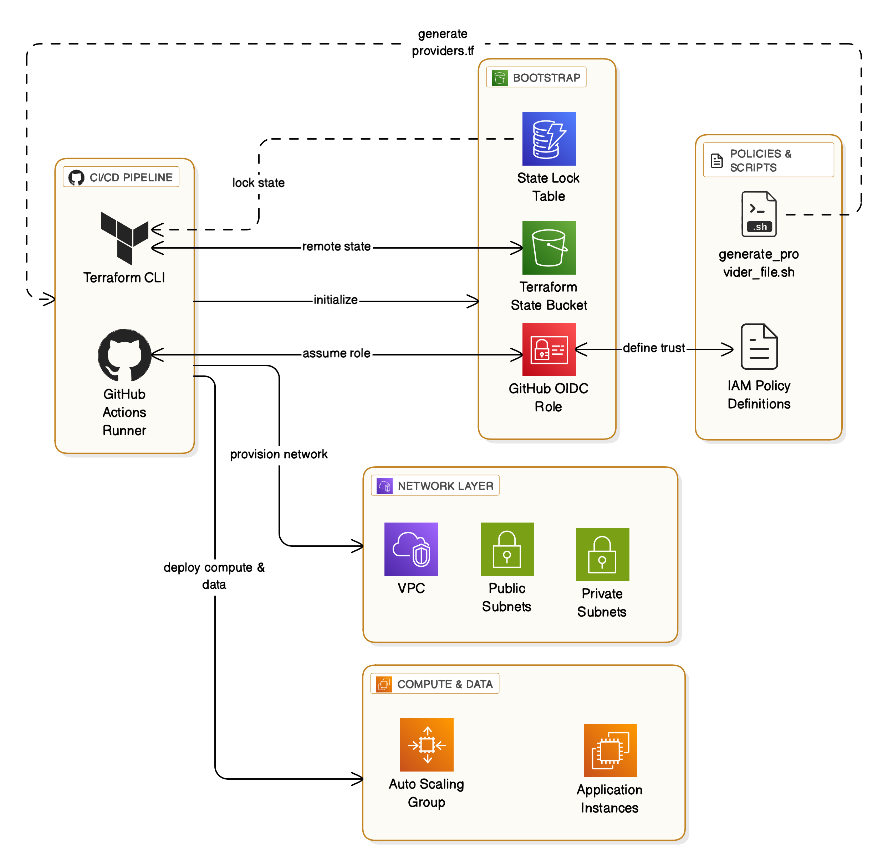

# Bootstrap Initialization for Terraform Projects  

The **bootstrap** directory provides a reusable setup phase for any Terraform project. It automates the foundational steps required before deploying environments by:  

- Setting up **GitHub OIDC trust** with your AWS account (no hard-coded credentials).  
- Creating a **remote backend** (S3 bucket + DynamoDB table) for Terraform state management.  
- Dynamically generating the `backend.tf` file for your project’s root directory.  
- (Optional) Deploying **CloudTrail** and **AWS Resource Explorer** modules for auditing and resource discovery.  
- Saving the created **GitHub OIDC role ARN** into **AWS SSM Parameter Store**, enabling reuse in main project infrastructure.  

---

## Directory Layout  

```bash
.
├── bootstrap
│   ├── bootstrap_diagram.png
│   ├── data
│   │   ├── asw-data
│   │   │   ├── data.tf
│   │   │   └── outputs.tf
│   │   └── repo-data
│   │       ├── data.tf
│   │       ├── get_repo.sh
│   │       └── outputs.tf
│   ├── main.tf
│   ├── modules
│   │   ├── backend-bucket
│   │   │   ├── generate-backend-file.sh
│   │   │   ├── main.tf
│   │   │   ├── outputs.tf
│   │   │   └── variables.tf
│   │   ├── cloudtrail
│   │   │   ├── access_analyzer_assume_role_policy.json
│   │   │   ├── access_analyzer_role_policy.json
│   │   │   ├── cloudtrail_bucket_policy.json
│   │   │   ├── main.tf
│   │   │   └── variables.tf
│   │   ├── explorer
│   │   │   ├── main.tf
│   │   │   └── resource-explorer-policy.json
│   │   └── oidc
│   │       ├── locals.tf
│   │       ├── main.tf
│   │       ├── outputs.tf
│   │       ├── policies
│   │       │   ├── permission-policy.json
│   │       │   └── trust-policy.json
│   │       └── variables.tf
│   ├── outputs.tf
│   ├── providers.tf
│   ├── random.tf
│   ├── terraform.auto.tfvars
│   ├── variables.tf
│   └── version.tf
├── layout-all.txt
├── LICENSE
├── Makefile
└── README.md
```

---

## Diagram  

  

---

## Requirements  

Before running the bootstrap, ensure the following tools are installed locally:  

- **Terraform v1.12.2**  
  [Install Terraform](https://developer.hashicorp.com/terraform/downloads)  

- **AWS CLI v6.7.0**  
  [Install AWS CLI](https://docs.aws.amazon.com/cli/latest/userguide/getting-started-install.html)  

- **GitHub CLI (`gh`)**  
  [Install GitHub CLI](https://cli.github.com/manual/installation)  

Authenticate before running:  
```bash
aws configure
gh auth login
```

---

## Features  

- **Remote Backend**  
  Creates an S3 bucket (state storage) and DynamoDB table (state locking).  

- **OIDC Trust**  
  Configures an IAM role with GitHub OIDC trust to enable secretless authentication for pipelines.  

- **Optional Modules**  
  - **Resource Explorer** (uncomment `module "explorer"` in `bootstrap/main.tf`)  
  - **CloudTrail** (uncomment `module "cloudtrail"` in `bootstrap/main.tf`)  

- **SSM Integration**  
  Stores the created GitHub CI role ARN into **SSM Parameter Store** at:  
  ```
  /tf-rds-cross-region-dr/ci-role-arn
  ```

---

## Getting Started  

### Step 1: Deploy Bootstrap  

From the repository root:  

```bash
make apply-bootstrap
```

This will:  
- Provision the S3 bucket and DynamoDB table.  
- Configure the IAM role with GitHub OIDC trust.  
- Save the CI role ARN into SSM Parameter Store.  
- Auto-generate the `backend.tf` file in your root directory.  

### Step 2: Define Permissions  

Edit the IAM permissions for your pipelines in:  

```bash
bootstrap/modules/oidc/policies/permission-policy.json
```  

### Step 3: Enable Optional Modules  

To enable **Resource Explorer** or **CloudTrail**, edit `bootstrap/main.tf` and uncomment:  

```hcl
# module "explorer" {
#   source = "./modules/explorer"
# }

# module "cloudtrail" {
#   source = "./modules/cloudtrail"
#   suffix     = module.asw-data.account_id
#   account_id = module.asw-data.account_id
# }
```

Then re-run:  

```bash
make deploy-bootstrap
```

### Step 4: Tear Down (Optional)  

To remove the bootstrap resources:  

```bash
make delete-bootstrap
```

---

## Author  

**Fekri Saleh**  
📧 Email: fekri.saleh@ucalgary.ca  
🔗 [LinkedIn](https://linkedin.com/in/your-profile) | [GitHub](https://github.com/fekri600)  
